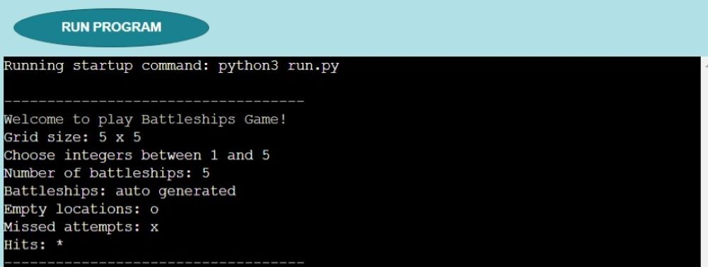
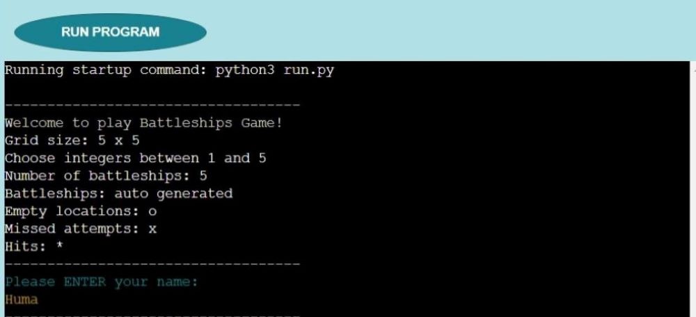

# Battleships Game 
The Battleships Game is based on the classic pen and paper game. More information about this game can be found at [Battleships Game](https://en.wikipedia.org/wiki/Battleship_(game)). This version of the game is designed for one player to play against the computer with randomly generated battleship locations on a grid. The player can try to beat the computer by hitting more batteleships of the computer before the computer hits the player's batteleships.

    

## [View live website](https://project-3-battleships-game.herokuapp.com/)

___
# Table of contents
- [Battleships Game](#battleships-game)
- [UX](#ux)
    - [Website owner goal](#website-owner-goal)
    - [External user goal](#external-user-goal)
    - [Structure of the website](#structure-of-the-website)
    - [Libraries used](#libraries-used)
    - [Surface](#surface)
- [Rules to play the game](#rules-to-play-the-game)
    - [Flowchart to plan Battleships Game logic](#flowchart-to-plan-battleships-game-logic)
- [Features](#features)
    - [Welcome message](#welcome-message)
    - [Player name](#player-name)
    - [Player attempt](#player-attempt)
    - [Computer attempt](#computer-attempt)
    - [Attempt result and message](#attempt-result-and-message)
    - [Data validation](#data-validation)
    - [Final scores and message](#final-scores-and-message)
    - [Continue play or quit game](#continue-play-or-quit-game)
- [Technologies used](#technologies-used)
- [Testing](#testing)
    - [Performance testing](#performance-testing)
    - [Code validation](#code-validation)
    - [Compatibility testing](#compatibility-testing)
    - [Issues found during site development](#issues-found-during-site-development)
    - [Unfixed bugs](#unfixed-bugs)
- [Deployment](#deployment)
- [Credits](#credits)

___
# UX

## Website owner goal
The main goals of the website owner are:
* To design the battleships game to be played on grids on which each player's fleet of battleships are marked. 
* To concealed the locations of the fleets from the other player, and players call shots at the other player's ships.
* To destroy the opposing player's fleet.
* To provide a working battleships game for a single player to play against the computer.

## External user goal
The main goal of the application user is:
* To play a logic game

## Structure of the website
* The design of the website is user-friendy as this is responsive on all type of devices: desktop, laptops, tablets, ipads, and mobiles.
* On all the above mentioned devices players can have a fantastic experience. 
* All parts of the website are designed to achieve maximum player satisfaction.

## Libraries used
The use of external Python libraries was implemented where appropriate to provide the functionality that the Battleships Game requires. The rationale to use the particular libraries for the implementation of Battleships Game is documented below.

### Random
Random is a library that allows to generate random numbers. Randint is imported from random because the game requires to generate random numbers. The locations for battleships were created by using random co-ordinates. For the computer's attempt the coordinates will be randomly generated to hit the battleship. 

### Colorama 
Colorama is a library that allows the color of text. Fore is imported from colorama to color the text to make the differentiation in color for the individaul parts of the game. For example, red color is given to the text of invalid statements.

## Surface
Different colors and fonts were used in the design of Battleships Game.

### Colors
Main colours used in the design of Battleships Game:
* font color: #FFFFFF; WHITE; YELLOW; CYAN; BLUE; GREEN; RED
* background color: rgb(177, 225, 231); rgb(26, 130, 144); rgb(0, 0, 0)
* border: rgb(9, 84, 94)

### Fonts 
* As a main font Arial and as a backup font sans-serif are used for the contents of the website.

[Back to Table of contents](#table-of-contents)

___
# Rules to play the game
* The player has to enter his/her name before randomly generating 5 ship locations on both player's grid and the computer's grid, these are signified with the letter "o".

* First the player has the attempt to hit the battleships on computer's grid. The player has to enter a number for a row and a column (essentially, co-ordinates) to hit the battleship. If the suspected location is on a battleship, it is a hit and marked as ' * '. If the location is not on a battleship, it is a miss and marked as ' x '.

* After that there will be the computer's attempt to hit the battleships on player's grid. The coordinates will be randomly generated to hit the battleship. If the suspected location is on a battleship, it is a hit and marked as ' * '. If the location is not on a battleship, it is a miss and marked as ' x '.

* The player and the computer will have ten attempts to find all the 5 battleships. If all the 10 attempts are taken with or without hiting all the 5 battleships, the result will be displayed with the final score and the message to announce the winner.

## Flowchart to plan Battleships Game logic
For the plan of Battleships Game logic, a flowchart was made, which is provided below. 

    

[Back to Table of contents](#table-of-contents)

___
# Features

## Welcome message
Welcome message will be displayed before the start of the game to indicate the player that he/she is going to play the Battleships Game with computer. The message will also indicate the grid size, how many battleships has to be found within the computer's grid, battleships will be auto generated, and the range of integers to be chosen.

    

## Player name
* The input of player's name will be asked in this section. Then player's name will be used throughout the game so that the player can personally enjoy the game.

    

* If the player will not enter the name, it will be asked again to enter the name to start the game.

    

## Player attempt
* The player will attempt to hit the battleships on computer's grid by giving his/her input. The player has to enter a number for a row and a column (essentially, co-ordinates) to hit the battleship. 

    

* If the suspected location is on a battleship, it is a hit and marked as ' * '. If the location is not on a battleship, it is a miss and marked as ' x '.

    

## Computer attempt
The computer will attempt to hit the battleships on player's grid. The coordinates will be randomly generated to hit the battleship. If the suspected location is on a battleship, it is a hit and marked as 
' * '. If the location is not on a battleship, it is a miss and marked as ' x '.

    

## Attempt result and message
After each attempt of the player and computer the updated score and message will be displayed to indicate that it was a hit or a miss. 

    

## Data validation
An integer is expected between 1 and 5.
* When an integer was entered outside of these bounds, the code displayed an error message, and a message to try again with the number between 1 and 5.

    

* When a letter was entered, the code displayed an error message, and a message to try again with an integer between 1 and 5.

    

* When a key was pressed without entering a value, the code displayed an error message, and a message to try again with an integer between 1 and 5.

    

 

* When entering a row and column number to hit the ship, which were already chosen, the code displayed an error message, and a message to try again with another number.

    

## Final scores and message
The player and computer will have ten attempts to find all the 5 battleships. If all the 10 attempts are taken with or without hiting all the 5 battleships, the result will be displayed with the final score and the message to announce the winner or the game is draw.

    

## Continue play or quit game
After the final scores and message, there will be a possiblity for a player to continue playing or quit the game.

    

[Back to Table of contents](#table-of-contents)

___
# Technologies used
Different technologies were used to complete the contents of Battleships Game:
### GitHub
* As a software hosting platform to keep project in a remote location.

### Git
* As a version-control system tracking.

### Gitpod  
* As a development hosting platform.

### Heroku
* Platform as a Service offering to carry out application deployment, scaling, and management.

### HTML5
* As a structure language.

### CSS
* As a style language.

### Python
*  As an interpreted, interactive, and object oriented scripting language.

[Back to Table of contents](#table-of-contents)

__
# Testing
The Battleships Game was tested for performance, code, and Compatibility.
## Performance testing
* The code to count the number of a character on the grid was checked.
* There were always five randomly created battleship locations when a grid was created.
* An integer is expected between 1 and 5.
    * When an integer was entered outside of these bounds, the code displayed an error message, and a message to try again with the number between 1 and 5.
    * When a letter was entered, the code displayed an error message, and a message to try again with an integer between 1 and 5.
    * When a key was pressed without entering a value, the code displayed an error message, and a message to try again with an integer between 1 and 5.
* When entering a row and column number to hit the ship, the co-ordinates were correct on the grid. 
* When entering a row and column number to hit the ship, which were already chosen, the code displayed an error message, and a message to try again with another number.
* The maximum number of attempts before the game was over were ten.
* When the player pressed ENTER to quit the game, the code was working properly and the game was stopped.

## Code validation
The Battleships Game is validated for a code using the python code validator.
* No errors were found when passing through the official [PEP8 online validator](http://pep8ci.herokuapp.com/#)

## Compatibility testing
The Battleships Game was tested across multiple virtual mobile devices and browsers.
 
## Issues found during site development
There were a few issues found during the design of Battleships Game.
* The use of linebreakes was corrected several times.
* Where to add the statement for the player that it is player's attempt, so that this statement should not display after ten attempts.

## Unfixed bugs
* No unfixed bugs 

[Back to Table of contents](#table-of-contents)

___
# Deployment
The Battleships Game was deployed using Code Institute's mock terminal for Heroku.
The steps for deployment were as follows:
* Fork or clone this repository
* Create a new Heroku app
* Set the buildpacks to Python and NodeJS in that order
* Link the Heroku app to the repository
* Click on Deploy

## [View live website](https://project-3-battleships-game.herokuapp.com/)

[Back to Table of contents](#table-of-contents)

___
# Credits
To complete the contents of Battleships Game, I learned coding and collected the information from different sources.
* Learned Python coding from [Code Institute](https://learn.codeinstitute.net/)
* Used Code Institute student template [python-essentials-template](https://github.com/Code-Institute-Org/python-essentials-template)
* The details about the battleships game were found at [Battleships Game](https://en.wikipedia.org/wiki/Battleship_(game))
* The description on the battleships game provided by the tutor of the Code Institute with [Ultimate Battleships](https://p3-battleships.herokuapp.com/) was useful as well as an inspiration to design Battleships Game.
* I acknowledge [Adegbenga Adeye](https://www.linkedin.com/in/adegbenga-adeye-psm-i-14003635/) for mentor support and finishing touches.

[Back to Table of contents](#table-of-contents)
